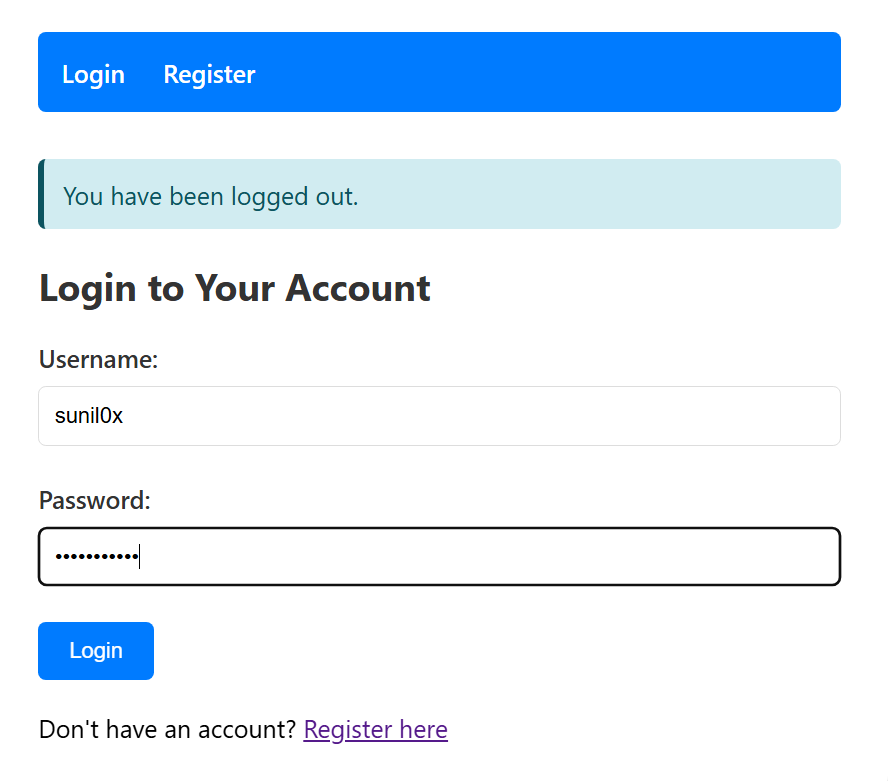
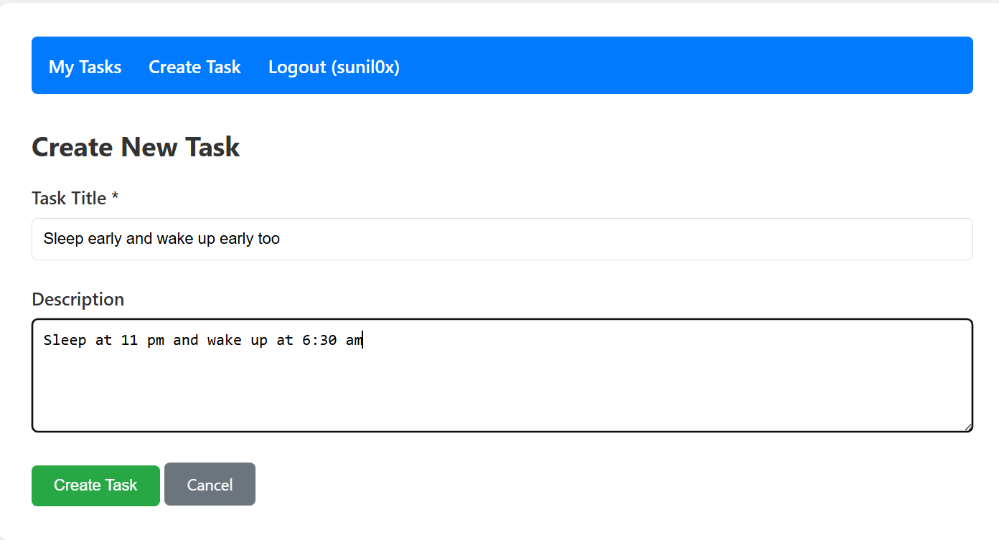
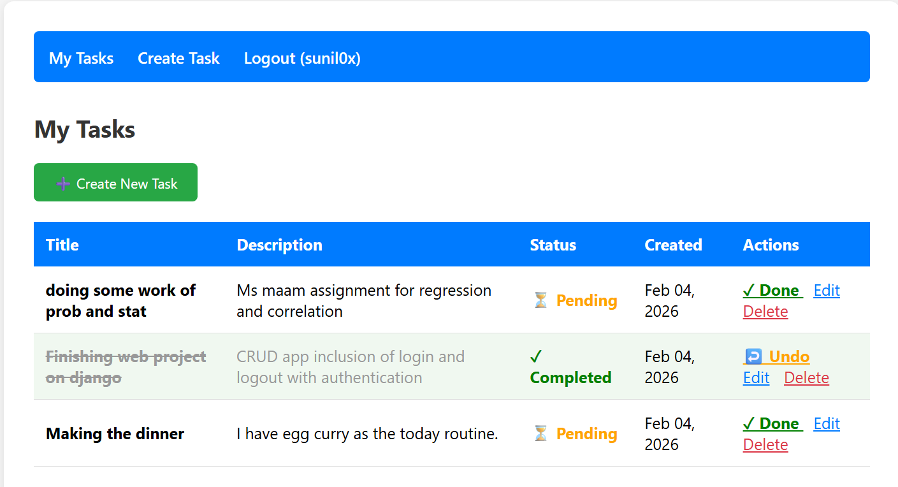
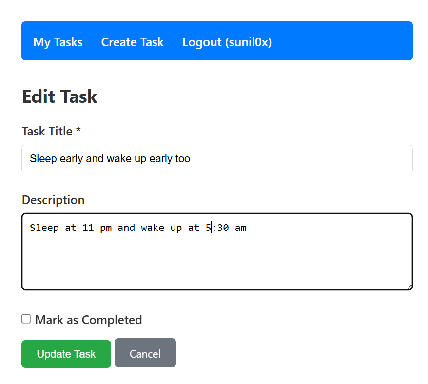
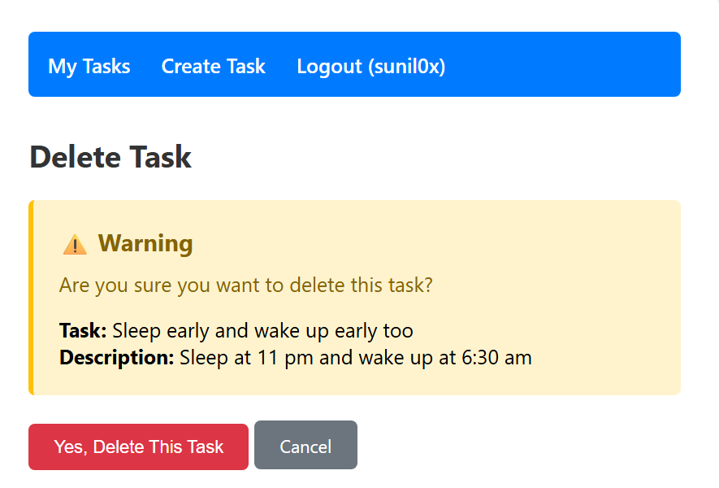

# Django Task Manager - CRUD Application with Authentication

A simple  task management web application built with Django. This project demonstrates full CRUD (Create, Read, Update, Delete) functionality with user authentication and authorization.


## ✨ Features

### Authentication System
- ✅ User Registration
- ✅ User Login
- ✅ User Logout
- ✅ Password validation
- ✅ Login required protection for task operations

### CRUD Operations
- ✅ **Create** - Add new tasks with title and description
- ✅ **Read** - View all your tasks in a clean table layout
- ✅ **Update** - Edit existing tasks and mark them as completed
- ✅ **Delete** - Remove tasks with confirmation dialog

## 📸 Screenshots

### Login Page

*Secure user authentication*

### Create New Task

*Simple form to add new tasks*

### Task List View

*View all your tasks with quick action buttons*


### Task List Update

*update your tasks*


### Delete Confirmation



### Task List View
- Display all tasks with status indicators
- Quick action buttons (Done/Undo, Edit, Delete)
- Visual distinction between completed and pending tasks

### Create/Edit Task Form
- Simple form with title and description fields
- Checkbox to mark task as completed (edit mode)
- Form validation

### Authentication Pages
- Clean registration form with password validation
- Login page with error handling
- Automatic redirects after authentication

## 🛠️ Technologies Used

- **Backend Framework:** Django 5.0+
- **Database:** SQLite (default, can be changed to PostgreSQL/MySQL)
- **Frontend:** HTML5, CSS3
- **Authentication:** Django's built-in authentication system
- **Template Engine:** Django Template Language (DTL)

## 🚀 Usage

### For Regular Users

1. **Register an Account**
   - Navigate to the registration page
   - Create a username and password
   - Password must be at least 8 characters

2. **Login**
   - Use your credentials to log in
   - You'll be redirected to your task list

3. **Create Tasks**
   - Click "Create New Task" button
   - Fill in the title (required) and description (optional)
   - Submit the form

4. **Manage Tasks**
   - **Mark as Done:** Click the "✓ Done" button
   - **Undo Completion:** Click the "↩️ Undo" button
   - **Edit:** Click "Edit" to modify task details
   - **Delete:** Click "Delete" and confirm

5. **Logout**
   - Click "Logout" in the navigation menu


## 📁 Project Structure

```
django-task-manager/
│
├── taskmanager/                 # Main project directory
│   ├── __init__.py
│   ├── settings.py             # Project settings
│   ├── urls.py                 # Project URL configuration
│   ├── wsgi.py
│   └── asgi.py
│
├── tasks/                       # Tasks app directory
│   ├── migrations/             # Database migrations
│   ├── templates/
│   │   └── tasks/              # HTML templates
│   │       ├── base.html       # Base template with navigation
│   │       ├── login.html      # Login page
│   │       ├── register.html   # Registration page
│   │       ├── task_list.html  # Task list view
│   │       ├── task_form.html  # Create/Edit form
│   │       └── task_confirm_delete.html
│   ├── __init__.py
│   ├── admin.py                # Admin panel configuration
│   ├── apps.py
│   ├── models.py               # Task model definition
│   ├── views.py                # View functions (CRUD + Auth)
│   ├── urls.py                 # App URL patterns
│   └── tests.py
│
├── manage.py                    # Django management script
├── db.sqlite3                   # SQLite database (created after migration)
└── README.md                    # This file
```
